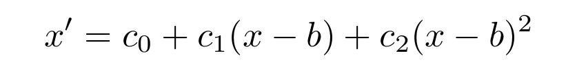

# *skintalk*

Serial communication for skin sensor testing boards

At LARRI, we have prototypes such the Octocan and ARNA handlebars that
use tactile sensing arrays with a common serial communication format.
This *skintalk* software reads binary serial data from the prototype's
MCU, parses encoded records, applies smoothing and a calibration
transformation, calculates center of pressure, and presents the
current state and center of pressure to an application using an API in
either C or Python.

Each tactel is referred to as a "cell" and each contiguous collection
of cells is a "patch."  For example, our Octocan prototypes have eight
sides (eight patches), and each patch has 16 cells (in a 4x4 or 2x8
arrangement), while some patches may have only nine cells per patch
(3x3 arrangement).  The MCU must be aware of and implement the cell
and patch arrangements by giving encoded addresses of patch & cell IDs
in the binary data.  The number of tactels and their arrangement is
expected to be fixed to the hardware, so the MCU code must be written
accordingly.  A [layout file](## Layout file) informs *skintalk* of
the number of patches and cells, as well as their physical
arrangements.  The physical arrangement is used only for center of
pressure calculations.

There are two goals of providing information to an application.
First, to allow access to the current state of *every cell*, and
second, to give a *higher level aggregation*.  Since our skin patches
are typically flat, the design of *skintalk* is to transform the
one-dimensional values of cells into a two-dimensional "center of
pressure" for each patch, given some 2D information about cells in a
patch (i.e. the [layout file](## Layout file)).  This enables the
application to further combine this 2D information into 3D space,
given some additional 3D information about the arrangement of
_patches_, if it so desires.

Rather than provide an update or callback every time the state
changes, the application must poll for the most recent state.

In C, control is through a `struct skin` object.  After setup and
starting, a single poll of the current state of an individual patch
uses the following function from `skintalk.h`:

    int skin_get_patch_state(struct skin *skin, int patch, skincell_t *dst);

where the destination `dst` is a pointer to an array of `skincell_t`
(double).  To poll the center of pressure,

    int skin_get_patch_pressure(struct skin *skin, int patch, struct skin_pressure *dst);

where the destination `dst` contains a magnitude and 2D position:

    struct skin_pressure {
	    double magnitude;
        double x, y;
    };

The C implementation is multi-threaded, so that the reading and
processing of serial data runs concurrently with the application
polling for state.  The Python interface is a "Python extension in C"
that uses the same C code, but provides access to data structures and
function calls through Python.

In Python, we use the `Skin` class and the instance method
`get_patch_state()` polls for the state of every cell of a given
patch, returning a list of all cell values, in order.  The method
`get_patch_pressure()` polls the center of pressure calculation for
a given patch, returning a list of [*magnitude*, *x*, *y*].

## Layout file

The layout file informs *skintalk* of the number of patches, number of
cells on each patch, and a two-dimensional arrangement of cells in
each patch.  Note that each patch is allowed to have a different
number of cells and different arrangements.  Ideally, we would like to
be able to query the MCU for this information, as it is expected to be
fixed to the hardware, but currently it must be provided as an
external file.

Currently, patch and cell IDs are limited to 4-bit values, where cell
IDs may be 0-15 but patch IDs must be 1-15, where 0 is reserved.

The layout file is a human written text file with the following fixed
format.  Blank lines and lines that start with `#` are ignored.

* The first line contains the total number of patches on the device.

        <number of patches>

* For each patch, a patch definition of the following format.  Notice
  that the number of patch definitions must match the number of
  patches provided above.
    * Starting line containing
	
            <patch ID>,<number of cells>
		   
	  The patch IDs do not have to be sequential or contiguous. The
      number of cells is the number of cells for this patch
      definition.  Each patch may have a different number of cells.
	* For each cell of this patch, a line containing

            <cell ID>,<x>,<y>

      The cell IDs do not have to be sequential or contiguous. The
      center of this cell is at the 2D position (*x*, *y*).  The units
      are up to the user, and the center of pressure calcuation will
      be provided in the same units.

## Calibration profile

While reading data from the device's MCU, *skintalk* applies a
calibration transformation to each cell value.  For each raw value
read from serial, the calibrated value uses the quadratic

where *b* is a **baseline calibration** value that is determined at
runtime as the average of noise while not pressing the sensor.  The
coefficient *c0* is also a linear offset, and is not really necessary
as there is also *b*; however, the design is let *c0* be fixed while
*b* can be changed at runtime.  The dynamic range calibration is set
using the linear coefficient *c1*.  We generally ignore the quadratic
coefficient *c2* (leaving it zero) and focus on setting the linear
coefficient to a useful value.

The calibration profile is a simple comma-separated values (CSV)
format, with the columns

    patch,cell,baseline,c0,c1,c2
	
The *patch* and *cell* columns are the IDs of the patches and cells
corresponding to the layout file.

The tool *tune.py* can be used to set both the baseline and dynamic
range (*c1*).  Pressing the "tare" button at the bottom of the
visualizer window of *tune.py* will measure the average of four
seconds while not pressing the sensors and set the baseline offset *b*
accordingly.  The second "Tune" window of *tune.py* allows the user to
either manually or automatically set the dynamic range (linear scaling
*c1*).  To automatically set *c1* coefficients, press the button to
the right of the cell's *c1*.  The input box's background will turn
red.  Press the sensor "firmly," to provide some maximum pressure and
release.  Press the button to the right of the input box again, and it
will calculate *c1* based on a target range (0-1000 by default).  This
target range is used to calculate the center of pressure (blue
circle).  Once the dynamic ranges are set, press the up/down arrow to
the right of "Tare" on the first window, and it will display live
values within the target range (e.g. 0-1000) with clipping.  The blue
"M" value at the bottom is the magnitude of total pressure, and the
red "x-bar" is the average mean of cell values.  You can tune
different patches by passing a different value using the `-p` command
line option.

